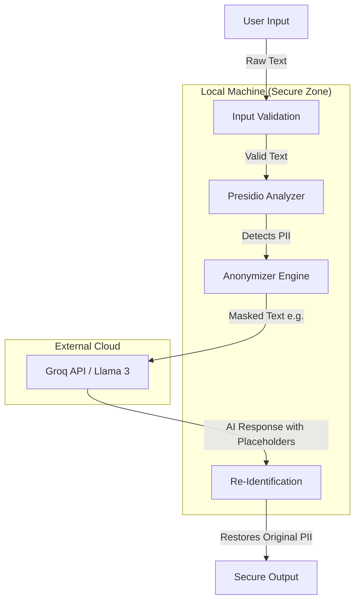
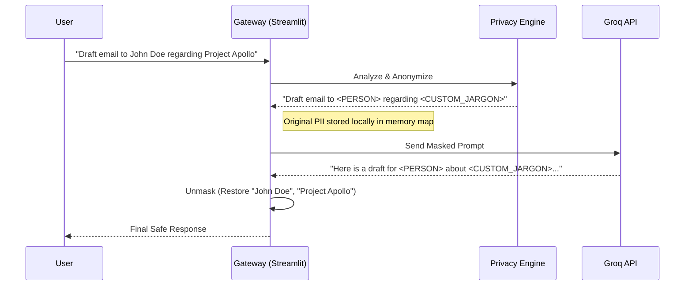

# Secure GenAI Gateway
## Data Loss Prevention for Large Language Models

A privacy-preserving proxy that sanitizes sensitive data locally before sending prompts to public LLMs, enabling secure use of cloud AI services without exposing confidential information.

 
 


---

## Overview

This tool functions as a security gateway between users and public AI providers (Groq/Llama 3). It automatically detects, redacts, and replaces sensitive information before data leaves your network, then re-identifies the content in AI responses—ensuring the LLM never processes actual confidential data.

**Target Users:** Security analysts, SOC teams, compliance officers, and privacy-conscious developers who need to leverage public AI capabilities without violating data protection policies.

## Core Capabilities

**Local Data Sanitization**
Automatically detects and masks Personal Identifiable Information (PII) and Sensitive Personal Information (SPII) including SSNs, credit cards, names, emails, and phone numbers before transmission.

**Custom Jargon Filtering**
Supports user-defined term blacklists for organization-specific sensitive information (project codenames, internal terminology, confidential product names).

**Compliance Audit Logging**
Records all masking operations to a structured JSON audit log for GDPR, HIPAA, and NIST compliance verification—without storing the actual sensitive values.

**Input Validation Layer**
Implements a "bouncer" module that blocks prompt injection attempts, excessive input lengths, and potential denial-of-service patterns before processing.

**Architectural Decoupling**
Maintains strict separation between the Data Plane (your sensitive information) and the Intelligence Plane (cloud AI processing).

---

## Architecture

### Data Flow

The system intercepts user input, sanitizes it locally, sends only masked data to the cloud, and restores original values in the response:



### Request Lifecycle



## How It Works

**1. Interception**
User submits text input or uploads a document (PDF/DOCX) through the Streamlit interface.

**2. Analysis & Masking**
The Privacy Engine (Microsoft Presidio + custom regex patterns) scans the content:

```
Input:  "My SSN is 123-45-6789 and email is john@company.com"
Masked: "My SSN is <US_SSN> and email is <EMAIL_ADDRESS>"
```

**3. Cloud Processing**
Only the masked text is transmitted to the Groq API (Llama 3.3) for AI processing.

**4. Re-Identification**
The AI response is intercepted and placeholders are replaced with original values using a local mapping table:

```
AI Response:    "Your <US_SSN> has been verified. We'll contact <EMAIL_ADDRESS>."
Final Output:   "Your 123-45-6789 has been verified. We'll contact john@company.com."
```

The original sensitive data never leaves the local environment.

---

## Installation

### Prerequisites

- Python 3.8 or higher
- Groq API Key (free tier available at [Groq Console](https://console.groq.com))

### Setup Instructions

**1. Clone the repository**

```bash
git clone https://github.com/YOUR-USERNAME/secure-ai-gateway.git
cd secure-ai-gateway
```

**2. Install dependencies**

```bash
pip install streamlit groq presidio-analyzer presidio-anonymizer python-dotenv pypdf python-docx pandas
python -m spacy download en_core_web_lg
```

**3. Configure API credentials**

Create a `.env` file in the project root:

```env
GROQ_API_KEY=gsk_your_key_here
```

**Important:** Add `.env` to your `.gitignore` to prevent credential exposure.

**4. Launch the gateway**

```bash
streamlit run gateway.py
```

The interface will be accessible at `http://localhost:8501`

---

## Usage

### Basic Text Input

1. Enter or paste text containing sensitive information
2. The system automatically detects and masks PII
3. View the sanitized prompt before sending
4. Receive AI response with original values restored

### Document Processing

1. Upload PDF or DOCX files via the interface
2. Text is extracted and analyzed automatically
3. Sensitive content is redacted before AI processing
4. Download the AI-generated response with proper re-identification

### Custom Jargon Configuration

Add organization-specific sensitive terms to the custom filter:

```python
# In gateway.py, modify the CUSTOM_JARGON list:
CUSTOM_JARGON = [
    "Project Apollo",
    "Operation Nightfall",
    "Client Codename Alpha"
]
```

---

## Configuration

### Supported PII Types

The system currently detects:
- Social Security Numbers (US_SSN)
- Credit Card Numbers (CREDIT_CARD)
- Email Addresses (EMAIL_ADDRESS)
- Person Names (PERSON)
- Phone Numbers (PHONE_NUMBER)
- IP Addresses (IP_ADDRESS)
- URLs (URL)

Modify detection patterns in the Privacy Engine configuration.

### Audit Log Format

Masking events are logged to `audit_log.json`:

```json
{
  "timestamp": "2024-02-10T14:23:45",
  "entity_type": "US_SSN",
  "action": "masked",
  "placeholder": "<US_SSN>",
  "user_session": "abc123"
}
```

Note: Original values are never written to logs.

---

## Known Limitations

**Prototype Status**
This is an alpha proof-of-concept demonstrating DLP principles. It requires additional hardening before production deployment.

**Context Preservation Issues**
Heavy redaction (e.g., multiple consecutive names) may reduce AI response quality due to lost context. Gender pronouns and relational references may be inconsistent.

**False Positive Detections**
Rigid regex patterns occasionally flag non-sensitive numeric sequences (e.g., reference numbers, dates) as SSNs or credit cards.

**File Format Support**
Currently limited to PDF and DOCX. Other formats (XLSX, images, presentations) are not supported.

**Single-Turn Conversations**
No conversation history is maintained between requests. Each query is treated independently.

---

## Development Roadmap

### Planned Features

- [ ] **Synthetic Data Replacement**: Use Faker library to replace placeholders with realistic dummy data, improving AI context understanding
- [ ] **OCR Integration**: Extract and redact sensitive text from images and screenshots
- [ ] **Conversation Memory**: Support multi-turn dialogues with persistent context
- [ ] **Additional LLM Support**: Extend beyond Groq to OpenAI, Anthropic, Azure OpenAI
- [ ] **Docker Deployment**: Containerized setup for simplified deployment
- [ ] **Role-Based Access Control**: Multi-user support with different sensitivity thresholds
- [ ] **Advanced Analytics**: Dashboard for monitoring redaction patterns and compliance metrics

### Potential Enhancements

- Real-time streaming responses with progressive re-identification
- Integration with enterprise SIEM systems
- Custom entity recognition model training
- Webhook support for automated workflows
- API endpoint for programmatic access

---

## Security Considerations

**Data Handling**
- Sensitive data is held in memory only during active sessions
- No persistent storage of unmasked PII
- API credentials are loaded from environment variables, never hardcoded

**Network Security**
- All external API calls use HTTPS
- Consider deploying behind a corporate firewall for additional protection

**Compliance**
- Audit logs support GDPR Article 30 record-keeping requirements
- HIPAA compliance requires additional access controls and encryption at rest

---

## Contributing

Contributions are welcome. Please follow these guidelines:

1. **Report Issues**: Use GitHub Issues for bug reports and feature requests
2. **Code Standards**: Follow PEP 8 style guidelines
3. **Testing**: Include test cases for new detection patterns or features
4. **Documentation**: Update README for any user-facing changes
5. **Pull Requests**: Create feature branches and submit PRs with clear descriptions

Areas particularly valuable for contribution:
- Additional PII detection patterns (international formats)
- Performance optimization for large document processing
- Enhanced error handling and user feedback
- Security audit and penetration testing

---

## Disclaimer

This tool is provided as-is for educational and demonstration purposes. It is not certified for use with regulated data (PHI, PCI-DSS, classified information) without proper security assessment.

**Use Responsibly:**
- Test thoroughly with non-sensitive data before production use
- Conduct security reviews appropriate to your risk profile
- Understand that no automated system is 100% accurate
- Maintain human oversight for critical data processing

---

## License

MIT License - see LICENSE file for details
